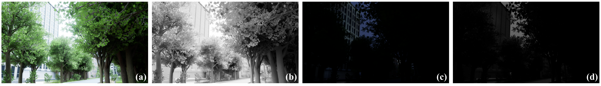
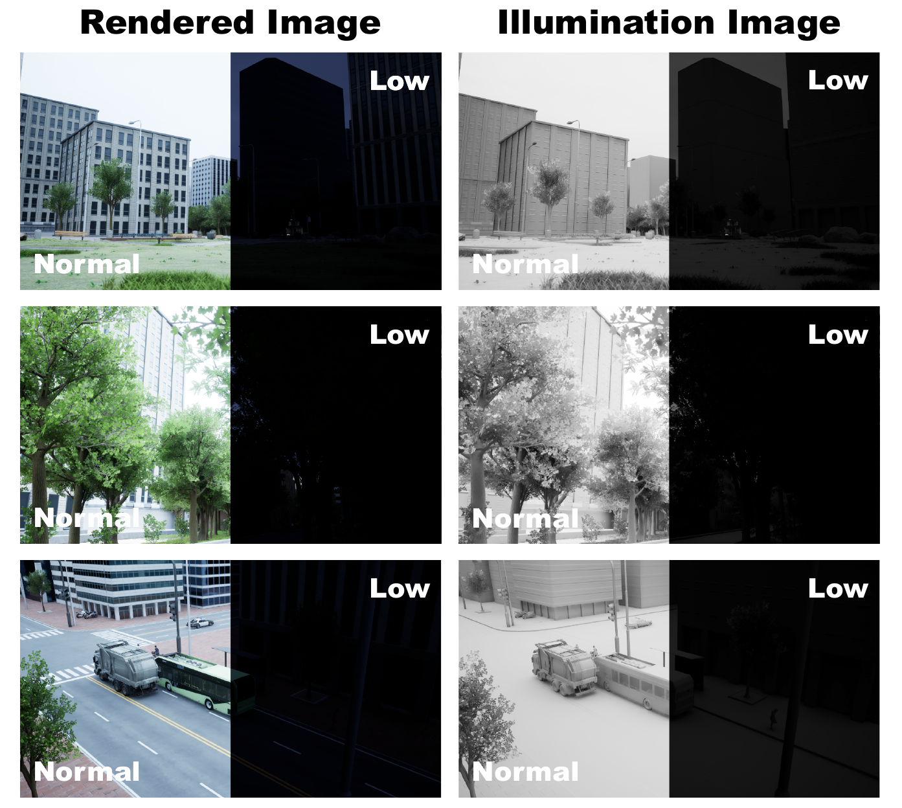
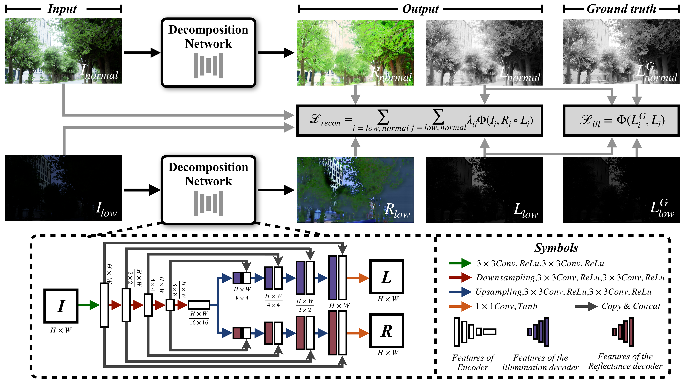

# Robust-Retinex
The official code of *"A Robust Deep Retinex Decomposition Network Leveraging a Novel Synthetic Dataset for Low-Light Image Enhancement"*
> 📝 Published in: IEEE International Conference on Multimedia and Expo Workshops (ICMEW), 2025  
> 🧑‍💻 Author: [Kaicheng Xu](https://github.com/Kylesesa), An Wei, Congxuan Zhang, Zhen Chen, Peng Liu, and Ke Lu.

## Datasets

  

    A set of example images from a single viewpoint in our PRI dataset.(a) The rendered image in normal-light conditions. (b) The illumination image in normal-light conditions. (c) The rendered image in low-light conditions. (d) The illumination image in low-light conditions.

  

    Some examples from our PRI dataset.

## Overall Framework

  

    The workflow of our robust Retinex decomposition method.

## Environment

## Train 

## Test

## Citation
